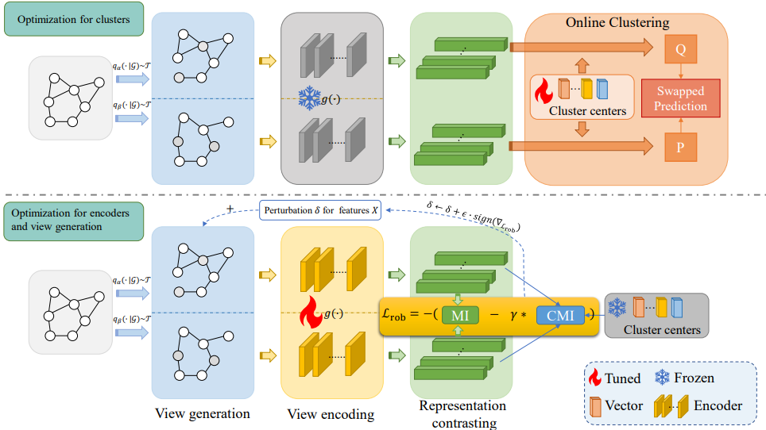

# MARIO: Model Agnostic Recipe for Improving OOD Generalization of Graph Contrastive Learning

**Official implementation of paper**  <br>[MARIO: Model Agnostic Recipe for Improving OOD Generalization of Graph Contrastive Learning](https://arxiv.org/abs/2307.13055) <br>

Yun Zhu, Haizhou Shi, Zhenshuo Zhang, Siliang Tang†

In WWW 2024

> Our codes are built up on [GOOD](https://github.com/divelab/GOOD).

## Overview


## Setup

```
conda create -n MARIO python==3.9
conda activate MARIO 
pip install torch==2.1.0 torchvision==0.16.0 torchaudio==2.1.0 --index-url https://download.pytorch.org/whl/cu121
pip install torch_geometric
pip install pyg_lib torch_scatter torch_sparse torch_cluster torch_spline_conv -f https://data.pyg.org/whl/torch-2.1.0+cu121.html
pip install munch ruamel_yaml cilog gdown dive_into_graphs tensorboard rich typed-argument-parser
```

## Usage

### Supervised Training
You can use this command to run GCN on GOODArxiv dataset under supervised setting.


`CUDA_VISIBLE_DEVICES=0 python supervised.py --config_path GOODCBAS/color/concept/ERM.yaml`


### Unsupervised Training

```
# baselines
python unsupervised.py --config_path GOODCBAS/color/concept/DGI.yaml

# Ours
python unsupervised.py --config_path GOODCBAS/color/concept/MARIO.yaml --ad_aug

python unsupervised.py --config_path GOODWebKB/university/concept/MARIO.yaml --ad_aug
```

### Command Line Arguments

`config_path` is an important command line argument which specify the dataset, OOD type and learning algorithm. You can specify it as:

`--config_path={dataset}/{domain}/{shift_type}/{method}.yaml`

These options are available now.
```
dataset: GOODCora, GOODTwitch, GOODCBAS, GOODWebKB
domain: according to the selected dataset(GOODCora: word or degree, GOODTwitch: language)
shift_type: covariate, concept, no_shift
method: ERM, EERM, IRM, GAE, VGAE, GraphMAE, DGI, MVGRL, GRACE, BGRL, COSTA, MARIO
```

### Hyperparameters

In the corresponding config yaml file (e.g., `GOODCora/word/covariate/GRACE.yaml`), you can assign training epochs (i.e., max_epoch) and learning rate (i.e., lr). And, for some methods, you can specify some additional hyperparametes (e.g., the strength of augmentation in GRACE and BGRL, temperature `tau` in GRACE, momentum `mm`  and `warmup steps` in BGRL and etc). 
